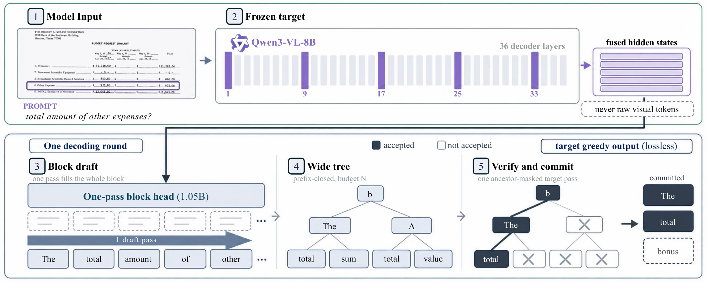
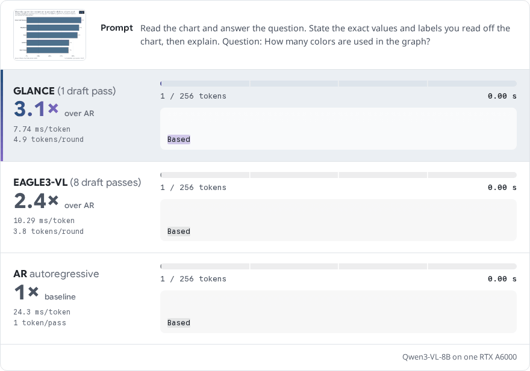
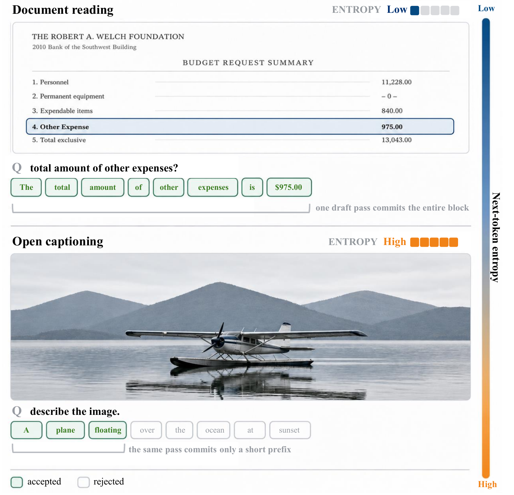
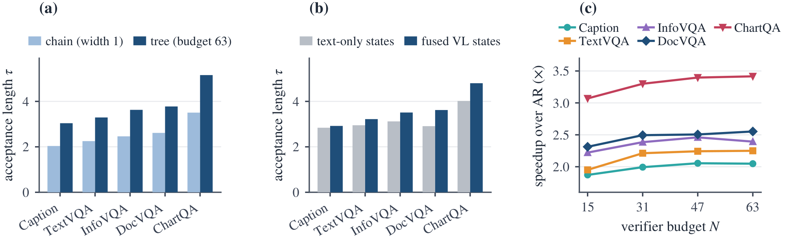

<div align="center">

# GLANCE

### Vision is not overhead

<em>Vision Is Not Overhead: One-Pass Block Drafting for Lossless Speculative Decoding in Vision-Language Models</em>

[](https://arxiv.org/abs/2609.00355)
[](https://js-lee-ai.github.io/GLANCE/)
[](LICENSE)
[](#citation)
[](https://www.python.org/)
[](https://github.com/js-lee-AI/GLANCE/stargazers)



<em>One draft pass fills the whole block from the frozen target's own fused vision-language state. The block's per-offset marginals become a wide prefix-closed candidate tree at no extra draft cost, and a single ancestor-masked target pass verifies every path at once.</em>

<b><a href="https://js-lee-ai.github.io/GLANCE/">Project Page</a> · <a href="#overview">Overview</a> · <a href="#install">Install</a> · <a href="#decode-with-it">Decode</a> · <a href="#the-candidate-tree-on-its-own">Candidate tree</a> · <a href="#the-draftability-law">Draftability law</a> · <a href="#results">Results</a> · <a href="#reproduce-the-main-experiment">Reproduce</a> · <a href="#citation">Citation</a></b>

</div>

<p align="center">
  <a href="https://js-lee-ai.github.io/GLANCE/#race"></a>
</p>

<p align="center"><em>Qwen3-VL-8B on one RTX A6000. The <a href="https://js-lee-ai.github.io/GLANCE/#race">project page</a> replays it live.</em></p>

---

## Overview

Speculative decoding makes generation faster without changing what the model says. On vision-language models it has been stuck in a cycle of its own premises. The drafter stays autoregressive, so a candidate `k` tokens deep costs `k` sequential draft passes, so the drafter has to stay small for those passes to be cheap. A small drafter cannot afford the image at every step, so image tokens get compressed, pruned, or hidden from it. A drafter cut off from the image is then least reliable about exactly the text the image already fixes.

GLANCE breaks the cycle at both ends.

* **Vision costs the drafter nothing.** A block-diffusion head reads the frozen target's already-fused vision-language hidden states at a few kept layers. It never sees raw visual tokens, and it never pays per step for having seen the image.
* **Depth costs no sequential passes.** One draft pass fills every offset of a block at once. Because the offsets are conditionally independent given the context, their marginals give a whole tree of candidate paths for free, and width becomes the cheap axis: it is bought inside the verify pass rather than with more draft passes.
* **The output does not change.** One ancestor-masked target pass verifies every path, and the walk commits the longest path the target itself would have taken. At temperature 0 that is the target's greedy output, token for token. Exactness is measured rather than assumed, and in fp32 GLANCE is bitwise identical to greedy decoding on all 60 audited prompts.

Grounded workloads reward this most. When a model reads a document or a chart, much of what it generates already exists in the image, so the next token is often near-deterministic and frequently an exact copy off the page. Those long verbatim runs cost an autoregressive drafter one pass per token and a block drafter one pass in total.

<div align="center">

</div>

<div align="center"><em>On a document page the image pins the answer and one draft pass commits the entire block. On open captioning many continuations are admissible, and the same pass commits only a short prefix.</em></div>

One relation organizes the results. Accepted length is set by the target's next-token entropy,

```
logit p = b0 - b1 * H        E[a | H] ≈ p (1 - p^L) / (1 - p),   L = 15
```

and the fitted slope steepens with grounding across all five tasks. The law transfers to a second target and to other modalities, and it names its own boundary: where entropy stays high, free-running text still favors a chain.

This repository is that decoder as a library, plus the code for the main experiment.

## Install

```bash
pip install -e .
```

The candidate tree and the draftability law run on numpy alone, so `import glance` works on a laptop with no GPU and no torch. Torch is imported only when a decoding entry point is first touched.

```bash
pip install -e ".[decode]"   # torch, transformers, pillow: needed to actually decode
```

The block head class itself comes from the `dflash` package, installed separately from [its project page](https://z-lab.ai/projects/dflash/). Keeping it out of this repository avoids a vendored copy drifting from the version you trained with.

## Decode with it

```python
import glance
from glance.vl import VisionPositions, load_target

target, processor = load_target("Qwen/Qwen3-VL-8B-Instruct")
head = glance.load_block_head("path/to/block-head")

inputs = processor.apply_chat_template(
    [{"role": "user", "content": [{"type": "image", "image": image},
                                  {"type": "text", "text": "What is the total?"}]}],
    add_generation_prompt=True, tokenize=True,
    return_dict=True, return_tensors="pt").to(target.device)

ids, stats = glance.generate(
    head, target, inputs["input_ids"], max_new_tokens=256,
    budget=63,                       # candidate tree size
    positions=VisionPositions(inputs["pixel_values"], inputs["image_grid_thw"]),
    return_stats=True)

print(stats.tau, stats.ms_per_token)
print(processor.tokenizer.decode(ids[0, inputs["input_ids"].shape[1]:]))
```

The target is frozen and unmodified throughout. Nothing is fine-tuned, no vision encoder is replaced, and the image is never pruned or re-tokenized.

Three baselines share the interface, which is what makes them comparable:

```python
glance.greedy_generate(target, ids, 256)              # plain autoregression, and the oracle
glance.chain_generate(head, target, ids, 256)         # the same head as a width-1 chain
glance.generate(head, target, ids, 256, budget=63)    # the wide tree
```

Text targets need no adapter at all, since `StreamPositions` is the default:

```python
ids, stats = glance.generate(head, text_model, prompt_ids, 256, return_stats=True)
```

## The candidate tree, on its own

The tree is the mechanism, and it is separable from everything else. Given one block draft's top-k per offset, it returns the budget-N highest path-probability candidates, prefix-closed and packed parents-first. No model, no GPU, no torch:

```python
from glance.tree import build_budget_tree, children_of

nodes = build_budget_tree(top_ids, top_logprobs, budget=63, branch_k=8)
len(nodes)                       # 63 candidates from a single draft pass
nodes[0].token, nodes[0].depth   # block offset this candidate sits at
```

`glance.tree_mask` turns those nodes into the additive attention mask that lets one target pass score every path under exactly the context it would have had.

## The draftability law

```python
from glance import DraftabilityLaw

law = DraftabilityLaw.fit(entropy, accepted)      # one pair per decoding round
law.b1                                            # slope: steeper where grounding is stronger
law.expected(0.05)                                # E[a | H] at near-certain next tokens
law.holds()                                       # (bool, the four conditions separately)
```

`holds()` is the bar the paper reports fits under, and it is deliberately unkind: the slope must be positive, the rank correlation negative and significant, the fit must clear either the decile curve or half of what entropy alone could explain, and the fit must be non-degenerate.

Single rounds are noisy, so `r2_round` is read against `r2_ceiling`, the share of round-level variance any function of entropy alone could reach. `DraftabilityLaw.fit` reports both.

## Results

Greedy decoding on Qwen3-VL-8B. Acceptance length `τ` is the mean number of tokens committed per round, so autoregressive decoding has `τ = 1`. A speedup is the ratio of the mean decode time for a token, autoregressive over speculative, with both arms measured in one engine on one GPU.

### Head to head in a production engine

Both drafters run inside SGLang 0.5.6 on one RTX A6000 in bf16, both CUDA-graph captured and both verifying a tree of 32 draft tokens a round. Engine, GPU, and round budget are thus shared, and the draft tokens come from eight sequential passes in EAGLE3-VL and from one pass in GLANCE.

| task | AR ms/tok | EAGLE3-VL τ | EAGLE3-VL ms/tok | EAGLE3-VL speedup | GLANCE τ | GLANCE ms/tok | GLANCE speedup | GLANCE faster by |
|---|---|---|---|---|---|---|---|---|
| captioning | 24.72 | **3.51** | **11.54** | **2.14x** | 2.92 | 13.10 | 1.89x | -11.9% |
| TextVQA | 24.34 | **4.31** | **9.56** | **2.55x** | 3.57 | 10.76 | 2.26x | -11.2% |
| InfographicVQA | 24.58 | 3.51 | 11.99 | 2.05x | **3.65** | **10.84** | **2.27x** | **+10.6%** |
| DocVQA | 24.91 | 3.68 | 11.67 | 2.14x | **3.91** | **10.51** | **2.37x** | **+11.0%** |
| ChartQA | 24.18 | 4.50 | 8.79 | 2.75x | **4.69** | **7.93** | **3.05x** | **+10.8%** |
| geometric mean | | | | 2.31x | | | **2.34x** | **+1.3%** |

On the three lower-entropy tasks, whose answers are read off a document or chart, GLANCE is the faster system by 10.6 to 11.0% and reaches 3.05x the speed of autoregressive decoding on ChartQA, from one draft pass a round instead of eight. Every paired bootstrap interval excludes zero, GLANCE is faster on at least 81 of the 101 prompts of each of these tasks, and it also leads on the five-task geometric mean, by 1.3% with a 95% interval from 0.3 to 2.2%. None of the three tasks appears in GLANCE's training data.

On captioning and TextVQA, the two tasks with the highest mean entropy, the eight-pass head leads. The head ranks candidates by a product of offset-wise marginals, which is accurate when the tokens of a block are nearly determined by the image, whereas on free-running text an autoregressive drafter stays coherent by construction. Consistently, GLANCE accepts longer blocks on every lower-entropy task than on either higher-entropy task, whereas the production head places TextVQA above both DocVQA and InfographicVQA.

### Against everything shipped for this target

| method (draft passes a round) | params | caption | TextVQA | InfoVQA | DocVQA | ChartQA | lossless |
|---|---|---|---|---|---|---|---|
| n-gram lookup (PLD, 0) | 0 | 1.29 | 2.49 | 2.53 | 3.30 | 2.57 | exact |
| Classic SD (Qwen3-VL-4B, 8) | 4.4B | **3.53** | **3.79** | **3.95** | **4.39** | 4.47 | exact |
| Classic SD (Qwen3-1.7B, text only, 8) | 2.0B | 1.49 | 1.42 | 1.90 | 1.68 | 2.12 | exact |
| EAGLE3-VL (production, 5) | 0.40B | 2.13 | 2.66 | 2.48 | 2.56 | 2.92 | exact |
| EAGLE-2 (ViSpec codebase, 3) | 0.23B | 2.41 | 2.45 | 2.38 | 2.54 | 2.89 | exact, audited |
| ViSpec (official recipe, 3) | 0.31B | 2.45 | 2.43 | 2.45 | 2.46 | 2.95 | exact, audited |
| Medusa (same codebase, 1) | 0.08B | 1.51 | 1.52 | 1.47 | 1.53 | 1.61 | exact, audited |
| **GLANCE (1)** | 1.05B | 3.09 | 3.46 | 3.75 | 3.76 | **5.12** | **exact, audited** |

Among trained heads, GLANCE accepts the longest blocks on all five tasks. Classic two-model speculation with a 4B draft accepts more on four of the five tasks, but a draft half the size of the target costs about half a target pass for each drafted token, so it slows decoding on every task. `exact` marks exact acceptance, and `audited` marks output audited bitwise identical to greedy decoding in fp32, on 60 of 60 prompts for GLANCE and on 63 of 63 for the three heads from the ViSpec codebase.

### Matched training

Both head architectures trained from scratch on one 26K-row corpus, with the same frozen target, global batch, schedule, and framework, then scored on 256 held-out prompts in one Hugging Face implementation.

| method (draft passes a round) | params | caption | TextVQA | InfoVQA | DocVQA | ChartQA |
|---|---|---|---|---|---|---|
| EAGLE3 head, depth-3 chain (3) | 0.40B | 1.62 | 1.59 | 1.55 | 1.58 | 1.87 |
| **GLANCE, budget-63 tree (1)** | 1.05B | **4.05** | **3.97** | **3.90** | **4.13** | **7.44** |

Pooled over the five tasks the acceptance ratio is 2.73, at 4.37 against 1.60. Retraining both heads on an ALLaVA-Instruct corpus under the same protocol gives 2.04 against 1.29. Timed in the same implementation on one A100, GLANCE decodes at 2.36 to 2.59x autoregressive decoding against 1.13 to 1.17x for the EAGLE-3 head. Run in SGLang under the shared tree of the production-engine comparison, GLANCE is faster on all five tasks, by 4.5% on captioning, 14.9% on TextVQA, and 16.1 to 25.7% on the three grounded tasks.

### On ViSpec's own target

Qwen2.5-VL-7B, the released ViSpec head against ours trained on that target.

| method (draft passes a round) | params | caption | TextVQA | InfoVQA | DocVQA | ChartQA | lossless |
|---|---|---|---|---|---|---|---|
| ViSpec (released head, 3) | 0.35B | 3.34 | **3.26** | 3.21 | 3.04 | 3.59 | exact, audited |
| **GLANCE (1)** | 1.23B | **4.00** | 2.61 | **3.47** | **3.12** | **4.72** | **exact, audited** |

GLANCE accepts longer blocks than the released ViSpec head on four of the five tasks.

### Where the gains come from

<div align="center">

</div>

**(a)** The identical head run as a width-1 chain and as a budget-63 tree. The tree accepts between 1.45 and 1.49x the chain's length on every task, a nearly constant factor, so the gain comes from the tree and not only from a larger head. **(b)** The head reading the target's fused states or a text-only language model's states, at budget 31. With the text-only states, acceptance falls on every task and most on grounded ones, since those states retain 97% of GLANCE's acceptance on captioning but only 80% on DocVQA. **(c)** Speedup against the verifier budget `N`, which is the knob `--budget` sets. Speedup rises from 15 to 31 on every task and then flattens.

## Reproduce the main experiment

Each task file is JSONL with an `image` path relative to the data directory and a `prompt` string:

```json
{"image": "docvqa/0001.png", "prompt": "What is the total amount of other expenses?"}
```

Run the five tasks. The autoregressive baseline and GLANCE run back to back on one card, in one process, so the speedup is a ratio between two numbers measured under the same conditions:

```bash
python experiments/main_table.py \
    --target Qwen/Qwen3-VL-8B-Instruct \
    --head path/to/block-head \
    --data data/vl_eval --tasks caption,textvqa,infovqa,docvqa,chartqa \
    --n 100 --budget 63 \
    --round-log results/rounds.jsonl \
    --out results/main_table.json
```

Add `--chain` to run the identical head as a width-1 chain in the same loop, which is the ablation that separates the head from the tree.

Gate the losslessness claim rather than assuming it:

```bash
python experiments/audit_lossless.py \
    --target Qwen/Qwen3-VL-8B-Instruct --head path/to/block-head \
    --data data/vl_eval --n 20 --out results/audit.json
```

The audit runs at fp32 on purpose. In bf16 the target does not reproduce *itself* on every prompt with no drafter in the loop at all, because a tree pass and a single-token pass reduce in different orders and near-ties land on either side. So the audit re-runs the plain autoregressive decode against itself and reports that control next to the result. A bf16 number would measure the arithmetic, not the method.

Fit the law on the rounds that run logged:

```bash
python experiments/fit_law.py results/rounds.jsonl --out results/law.json
```

Three conventions decide numbers here and are easy to get silently wrong, so they are stated in `glance/metrics.py` and applied throughout. The first sample of a run is a warm-up and is dropped, which is why a hundred reported samples are measured as a hundred and one. A task's accepted length pools rounds rather than averaging prompts, since prompts differ in how many rounds they take. Speedups are ratios, so tasks combine by geometric mean, always against each system's own baseline.

## What is in here

```
glance/tree.py        the prefix-closed candidate tree and its attention mask
glance/decode.py      the decoding loop: tree, chain, and the autoregressive oracle
glance/head.py        what the head reads off the target, and loading a trained one
glance/vl.py          M-RoPE positions and vision prefill for Qwen-family VLMs
glance/law.py         the draftability law, its fit, and its diagnostics
glance/metrics.py     acceptance, geometric-mean speedup, paired bootstrap

experiments/main_table.py       accepted length and speed on the five tasks
experiments/audit_lossless.py   bitwise equality against greedy decoding, at fp32
experiments/fit_law.py          fit the law on a run's round log
```

Two notes for anyone reading the decoder closely.

**The extension past the block.** `generate(..., extend_budget=N)` spends one extra draft pass, with the drafter's own greedy spine revealed rather than masked, to price offsets past the block and hang a subtree off the spine leaf. It is verified in the same target pass as everything else, and candidates only ever widen, so the acceptance walk and its guarantee are untouched. It needs a head trained with a variable mask span, and is off by default.

**Two timing conventions.** `timing="decode_only"` opens the window after the prefill and after the first round's drafting, and synchronizes before both reads. This is what block-diffusion drafters report, and it is what the tables above use. `timing="legacy"` measures from before the prefill. They are not comparable, so do not mix them in one table.

## Citation

```bibtex
@article{lee2026glance,
  title   = {Vision Is Not Overhead: One-Pass Block Drafting for Lossless
             Speculative Decoding in Vision-Language Models},
  author  = {Lee, Jungseob and Hong, Seongtae and Lee, Dongyub Jude and Park, Chanjun and Seo, Jaehyung and Eo, Sugyeong and Lim, Heuiseok},
  journal = {arXiv preprint arXiv:2609.00355},
  year    = {2026},
  url     = {https://arxiv.org/abs/2609.00355}
}
```

GLANCE builds a candidate tree on top of a block-diffusion draft head in the style of [DFlash](https://arxiv.org/abs/2602.06036), which is cited rather than re-claimed. What is new here is reading the target's fused vision-language state instead of a stripped-down copy of the image, spending one pass of block marginals on width, and gating the result on exact reproduction of greedy decoding.

## License

Code is MIT, see [LICENSE](LICENSE). The paper is CC BY 4.0.
